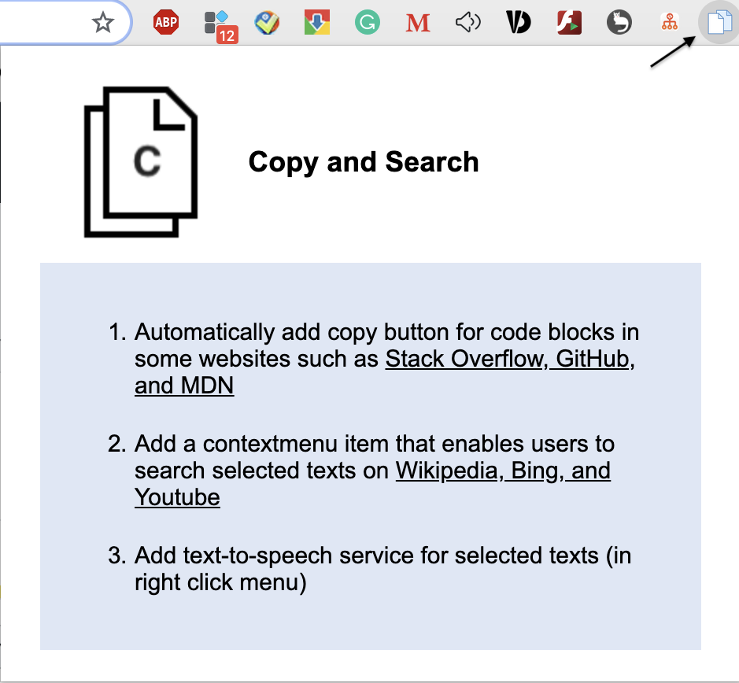
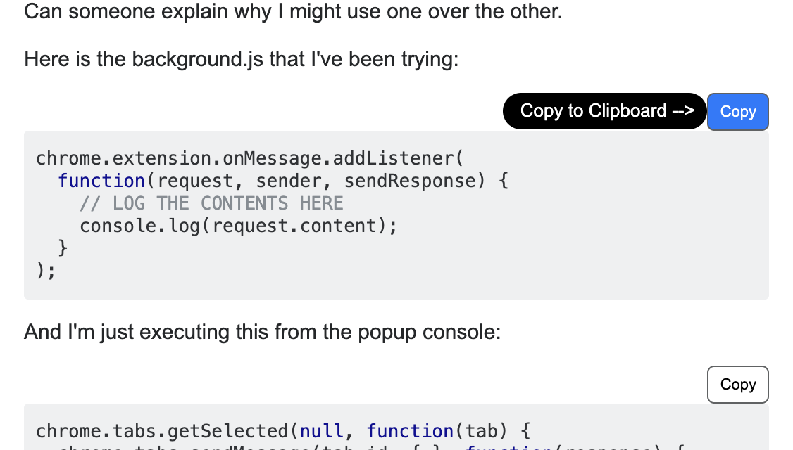
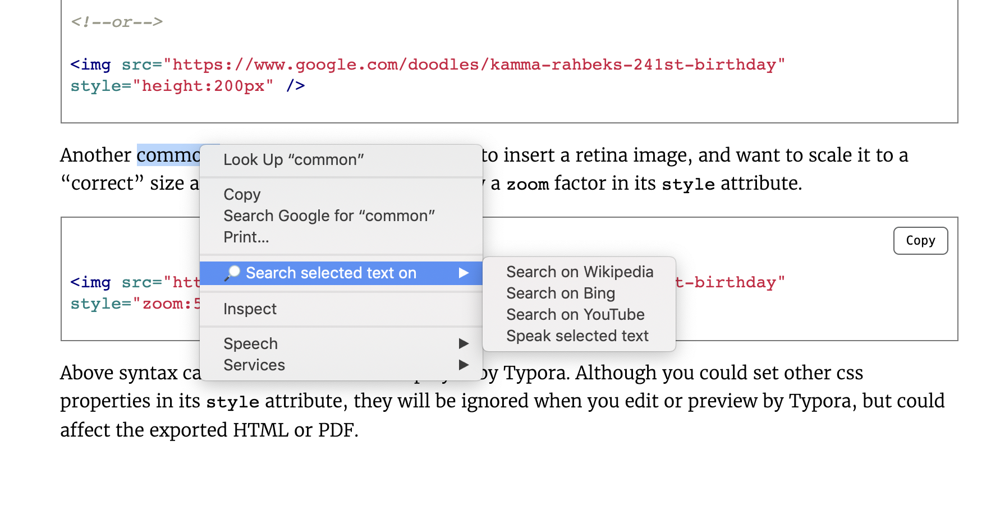

# Extension-Copy code and Search
**A Chrome Extension**

* Add one-click copy button for code blocks on stackoverflow, github, MDN...
* Enable searching selected text on different search engines like wikipedia, bing as well as youtube.
* Speak out seleceted text using text-to-speech API

**Visual Illustration**

- POPUP html
  - 

- Copy Button
  - 

- Context Menu Item
  - 