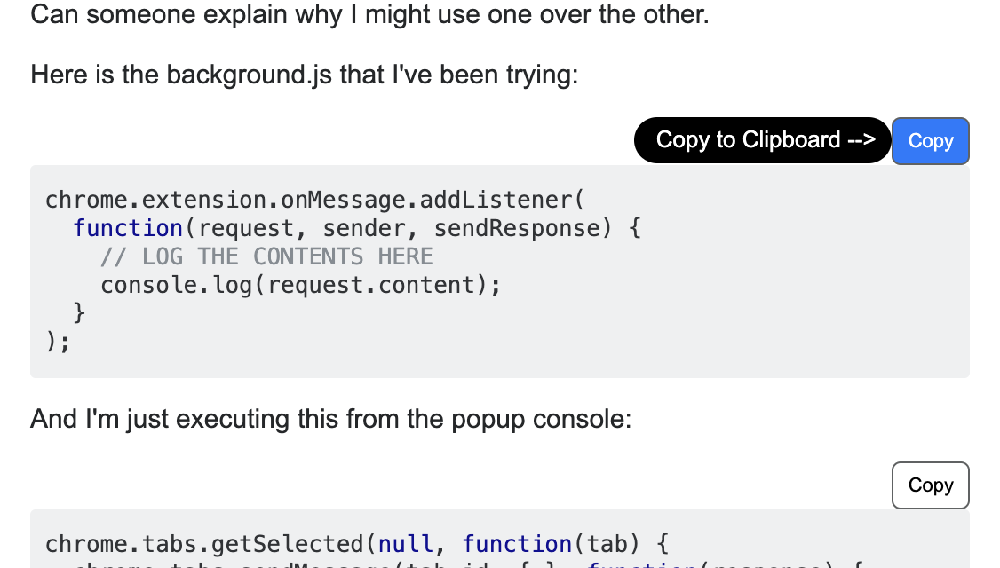

# Extension-Copy code and Search
###A Chrome Extension

* Add one-click copy button for code blocks on stackoverflow, github, MDN...
* Enable searching selected text on different search engines like wikipedia, bing as well as youtube.
* Speak out seleceted text using text-to-speech API

###Visual Illustration

- **Popup Html**
  
- 
  
  
  
  ---
  
- **Copy Button**

<<<<<<< HEAD
  - 

  ---

- **Context Menu Item**

  - 
=======
- Copy Button
  - 

- Context Menu Item
  - 
>>>>>>> ee7f10dc586a32f64b9f82d0d30ca5f34bfa4c68
